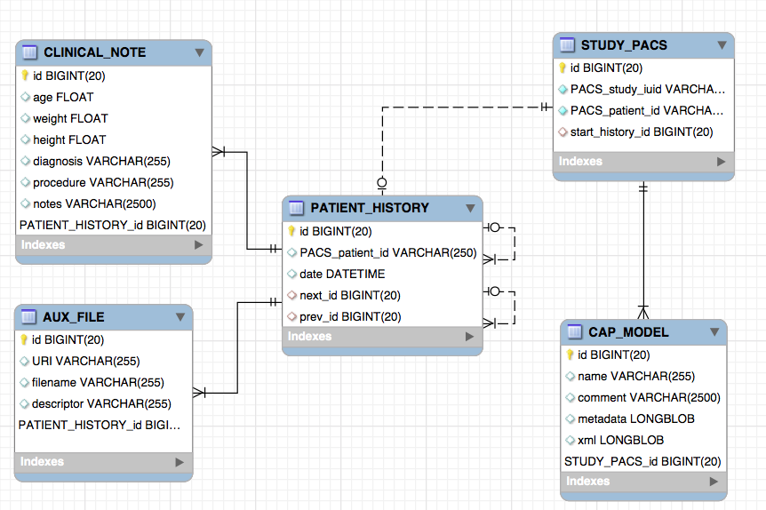

# CAPServer2.0

The new CAP server consists of two separate databases:

* PACS (Picture Archiving and Communication System) to store DICOM images based on open source [DCM4CHE] framework.
* XPACS (auXiliarry PACS) database that stores non-DICOM image data.

Both databases are implemented in MySQL database server.

**PACS schema (ver 2.18)**

**XPACS schema (ver 0.1)**

Two main tables defined in XPACS:

1. **STUDY_PACS** which links to PACS' study_iuid row in the STUDY table. The STUDY_PACS table is used to attached metadata information to a study. One example is the CAP's LV models, which are stored in CAP_MODEL table. Each model is linked with a study.

1. **PATIENT_HISTORY** which loosely link to PACS' patient_id in the PATIENT table. The PATIENT_HISTORY table implements double-linked list of clinical events. If an event does not have an associated scan, then PACS_patient_id value is NULL. Chain events are linked through forward next_id and backward prev_id values. NULL values determines the end of the chain.

   Two tables are attached to PATIENT_HISTORY: CLINICAL_NOTE (all diagnostic information) and AUX_FILE (additional extra files, such as PDF, JPG, etc.). Files are stored externally by using [URI] locator.

<!-- URLs -->
[DCM4CHE]: http://dcm4che.org/
[URI]: https://en.wikipedia.org/wiki/Uniform_Resource_Identifier
