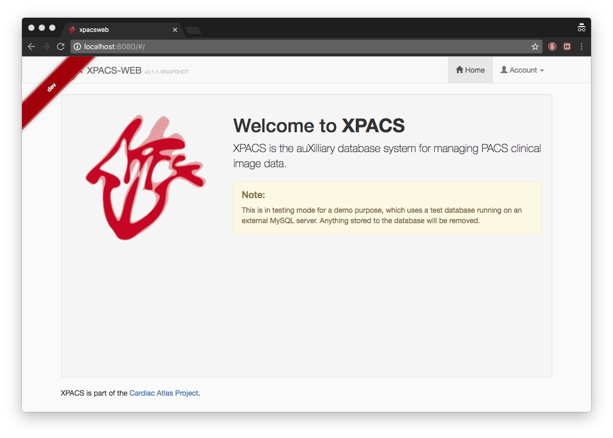

# CAPServer2.0

Requirements for development:
* [Oracle VM VirtualBox](https://www.virtualbox.org/)
* [Vagrant](https://www.vagrantup.com/)
* [Spring suite IDE](http://spring.io/) (can be Eclipse with STS plugin)


## Quick start up

Fresh installation using vagrant:
```
$ cd CAPServer2.0
$ vagrant plugin install vagrant-vbguest
$ vagrant up
$ vagrant ssh
[vagrant@localhost ~]$ cd xpacs
[vagrant@localhost ~]$ mvn -N io.takari:maven:wrapper
[vagrant@localhost ~]$ ./mvnw
```

Open http://localhost:8080, you should see the XPACSWEB interface:



## Configuring the vagrant vm

Read [Vagrant documentation](https://www.vagrantup.com/docs/) for more details on configurations and custom commands. You can modify the `Vagrantfile` configuration file to customize your development environment. Examples are creating a scratch folder for your testing, or setting port forwarding on some services.

## Install DCM4CHEE-ARC database

The XPACS-WEB application needs to connect to a PACS database to retrieve patients' image information. You need to install DCM4CHEE-ARC separately on your vagrant VM.

Follow [installation notes for dcm4chee-arc with MySQL server on the same vagrant VM above](https://github.com/CardiacAtlasProject/dcm4chee-arc-notes) to install the dcm4chee server.

**Note that you do not have to setup vagrant again.**

## Production mode

For the production mode, you need to setup a database called `xpacsweb` and how to access it.
