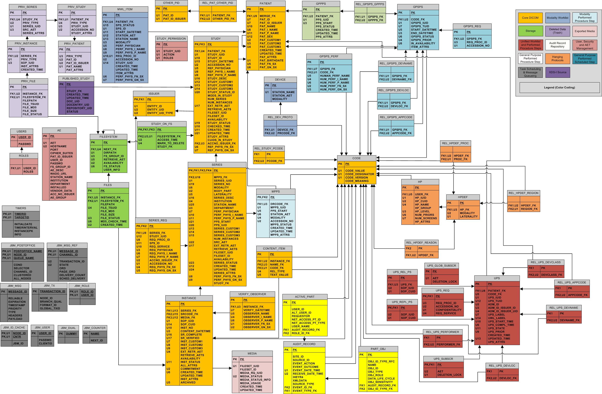

# CAPServer2.0

The new CAP server consists of two separate databases:

* PACS (Picture Archiving and Communication System) to store DICOM images based on open source [DCM4CHE] framework.
* XPACS (auXiliarry PACS) database that stores non-DICOM image data.

Both databases are implemented in MySQL database server.

**PACS schema (ver 2.18)**

**XPACS schema (ver 0.2)**

Table description:

1. **PATIENT_INFO** contains unique PatientID list. The PatientID is the first 8 digits of CAP IDs because the last 2 digits of CAP IDs contains follow up imaging sessions. For examples, XYZ0001501, XYZ0001502 are the same patient with ID = XYZ00015. This patient has 2 imaging sessions in the PACS database.PATIENT_INFO only stores one row for this patient.

   There is a link to the first chain of PATIENT_HISTORY table with `first_history_id` column (NULL is allowed).

1. **PATIENT_HISTORY** contains double-linked chains of events with `Next_id` and `Prev_id` columns (NULL value states the end of the chain). Each event may contain a clinical note (CLINICAL_NOTE), auxiliary file (AUX_FILE) or imaging session (STUDY_PACS).

1. **CLINICAL_NOTE*** contains an event diagnostic notes. It is generic table.

1. **AUX_FILE** contains links to external files. It can be PDF notes, echocardiography, etc.

1. **STUDY_PACS** which links to study_iud row in the PACS' STUDY table (see above). This is not a complete list of studies from PACS database, but as an attachment of either an event in the PATIENT_HISTORY table, or a heart model in the CAP_MODEL table, or a baseline diagostic in the BASELINE_DIAGNOSIS table.

1. **CAP_MODEL** contains a model of the heart. This table is generic to hold any model format. The definition is in the `ModelData` column which is a binary ZIP file and model's XML metadata information is stored in the `XMLData` column.

1. **BASELINE_DIAGNOSIS** contains some common lab report attached to an imaging session.

<!-- URLs -->
[DCM4CHE]: http://dcm4che.org/
[URI]: https://en.wikipedia.org/wiki/Uniform_Resource_Identifier
