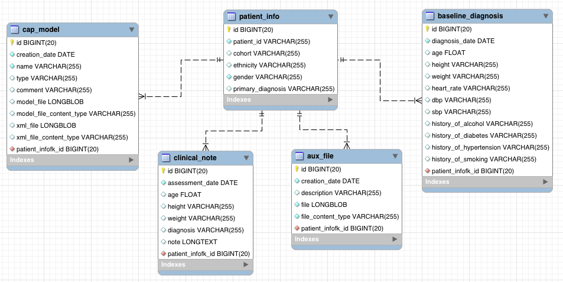

# CAPServer2.0

The new CAP server consists of two separate databases:

* PACS (Picture Archiving and Communication System) to store DICOM images based on open source [DCM4CHE] framework.
* XPACS (auXiliarry PACS) database that stores non-DICOM image data.

Both databases are implemented in MySQL database server.

**PACS schema (ver 2.18)**

**XPACS schema (ver 0.3)**

This schema is centralised by the `PATIENT_HISTORY` table, which holds events of patients. An event is either imaging session exam, GP visit, cath lab, etc. All are identified by CAP's patient_id. The column PACS_study_iuid links to an imaging session in the STUDY table of the PACS schema (see above). If an event is not an imaging exam, this column will be NULL.

A list of patients are stored in the table `PATIENT_INFO` that holds persistence data of a single patient. These values are constant at each event.

Four tables are linked to `PATIENT_HISTORY` :
* `CLINICAL_NOTE`
* `AUX_FILE`, which contains links to [URI] of files stored externally.
* `CAP_MODEL` that defines a heart model.
* `BASELINE_DIAGNOSIS`

<!-- URLs -->
[DCM4CHE]: http://dcm4che.org/
[URI]: https://en.wikipedia.org/wiki/Uniform_Resource_Identifier
