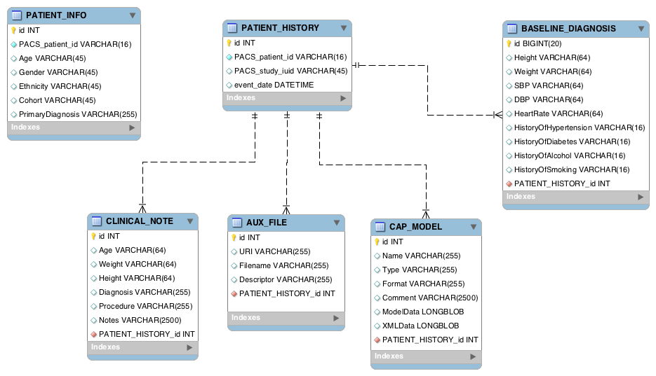

The new CAP server consists of two separate databases:

* PACS (Picture Archiving and Communication System) to store DICOM images based on open source [DCM4CHE] framework.
* XPACS (auXiliarry PACS) database that stores non-DICOM image data.

Both databases are implemented in MySQL database server.

**PACS schema (ver 2.18)**


**XPACS schema (ver 0.3)**


This schema is centralised by the `PATIENT_INFO` table that holds persistence data of a single patient. These values are constant at each event. Events are stored in each other tables linked to `PATIENT_INFO` (note each table has DATE type to indicate the event date). An event is either imaging session exam, GP visit, cath lab, etc. All rows are identified by CAP's `patient_id`.

Four tables are linked to `PATIENT_INFO` :
* `CLINICAL_NOTE`
* `AUX_FILE`, which contains files stored internally.
* `CAP_MODEL` that defines a heart model.
* `BASELINE_DIAGNOSIS`


# Installing MySQL 5.7

You need to install and setup MySQL 5.7 manually because CentOS 7 prefers MariaDB
when you install by default.

1. Install MySQL 5.7 package
   ```
   $ sudo rpm -ivh ~/dbase/mysql/mysql57-community-release-el7-9.noarch.rpm
   ```

2. Install the server
   ```
   $ sudo yum -y install mysql-server
   ```

3. Start MySQL server

   ```
   $ sudo systemctl start mysqld
   ```

   To check whether it has been started properly:
   ```
   $ sudo systemctl status mysqld
   ```

   You should see status containing `Active: active (running)`.

4. Initializing root password

   During the installation process, a temporary password is generated for the MySQL root user. Locate it in the `mysqld.log` with this command:
   ```
   $ sudo grep 'temporary password' /var/log/mysqld.log
   ```

   Make a note of that password before running MySQL secure initialization for the first time:
   ```
   $ sudo mysql_secure_installation
   ```

   Enter a new 12-character password that contains at least one uppercase letter, one lowercase letter, one number and one special character. Re-enter it when prompted.

 6. Create XPACS database

    ```
    $ mysql -uroot -p
    mysql> CREATE DATABASE xpacs;
    ```

 5. Create user

   This user will be used in the code to connect to both XPACS and PACS database. It is recommended that you use the same password and privileges for both database. Instructions to install the PACS database can be seen from [DCM4CHEE installation on MySQL](https://github.com/dcm4che/dcm4chee-arc-light/wiki/Installation#mysql-and-mariadb).

   Use the same username and password, e.g.
   ```
   mysql> CREATE USER 'cap'@'%' IDENTIFIED BY '*CapUser*1234' PASSWORD EXPIRE NEVER;
   mysql> GRANT ALL ON xpacs.* TO 'cap'@'%' IDENTIFIED BY '*CapUser*1234';
   ```
